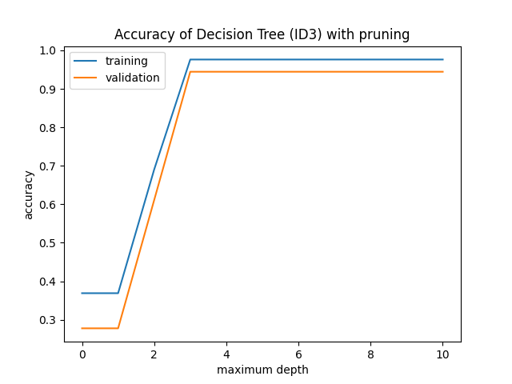

# Decision Tree
## Dependencies
In order to run the scripts, make sure the following libraries
are installed on your machine:

| Library    | Use case                   |
| :------   | -------------------------  |
| `numpy`     | Efficient math operations  |
| `pandas`    | Efficient data-handling    |
| `matplotlib`| Efficient plotting         |
| `tqdm`      | Progress bars              |

## Running
Run the module as
```bash
python main.py --train_dir path_to_training_set --test_dir path_to_test_set --val_prop validation_set_proportion
```
## Output
The output will be displayed on the command line itself. Beside that,
two plots `analyze_without_pruning.png` and `analyze_with_pruning.png`
will be generated in the parent folder of `main.py`.
* `analyze_without_pruning.png` contains the plots of training and validation accuracies
of best decision tree for all the maximum allowed depth without any pruning.
* `analyze_with_pruning.png` contains the plots of training and validation accuracies
of best decision tree for all the maximum allowed depth with pruning.
## Demo Output
In the command line, you can expect to see following output:
```
Building decision trees..
100%|████████████████████████████████████████████████████████████████████████████████| 220/220 [00:16<00:00, 13.72it/s]
Pruning decision trees..
100%|████████████████████████████████████████████████████████████████████████████████| 220/220 [00:17<00:00, 12.77it/s]

----------------------------------------------------------------------------------------------------
Best unpruned tree..

data = {'Iris-setosa': 27, 'Iris-versicolor': 26, 'Iris-virginica': 31}
info_gain = 0.905928216042999
if petal_length < 3.3:
        data = {'Iris-setosa': 27}
        class = Iris-setosa
else:
        data = {'Iris-versicolor': 26, 'Iris-virginica': 31}
        info_gain = 0.8034788104718056
        if petal_width < 1.7:
                data = {'Iris-versicolor': 24}
                class = Iris-versicolor
        else:
                data = {'Iris-versicolor': 2, 'Iris-virginica': 31}
                class = Iris-virginica


training accuracy = 0.9761904761904762
validation accuracy = 0.9444444444444444
test accuracy = 0.9

----------------------------------------------------------------------------------------------------
Best pruned tree..

data = {'Iris-setosa': 27, 'Iris-versicolor': 26, 'Iris-virginica': 31}
info_gain = 0.905928216042999
if petal_length < 3.3:
        data = {'Iris-setosa': 27}
        class = Iris-setosa
else:
        data = {'Iris-versicolor': 26, 'Iris-virginica': 31}
        info_gain = 0.8034788104718056
        if petal_width < 1.7:
                data = {'Iris-versicolor': 24}
                class = Iris-versicolor
        else:
                data = {'Iris-versicolor': 2, 'Iris-virginica': 31}
                class = Iris-virginica


training accuracy = 0.9761904761904762
validation accuracy = 0.9444444444444444
test accuracy = 0.9

----------------------------------------------------------------------------------------------------
View 'accuracy_without_pruning.png' and 'accuracy_with_pruning.png' to see the performance of all the decision trees

DONE.
```





