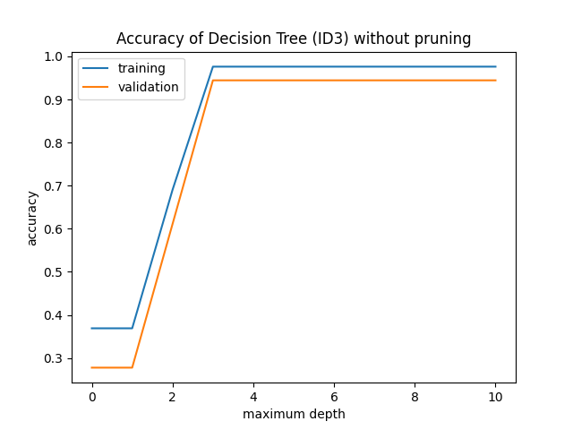

# Decision Trees
## Introduction
This repository contains the code for the MIES Coding Assignment-1. The dataset used in
the assignment is _Fisher's Iris dataset_. The Iris Dataset contains four features
(length and width of sepals and petals) of 50 samples of three species of 
Iris (_Iris setosa, Iris virginica and Iris versicolor_). These measures are used to
create decision trees (as per _ID3_ algorithm) to classify the species.

As all the attributes are real-valued,
`attribute < threshold` paradigm is used for creating nodes in the trees. `Node` class acts
as a wrapper for the nodes in the trees, while `DecisionTree` class is used as wrapper
for the entire tree itself. 
## `Node` class
`Node` class acts as wrapper for the nodes in the decision tree. The attributes and functions
defined in this class are listed below.

| Attribute          | Significance                            |
|--------------------|-----------------------------------------|
| `x`                  | training instances contained in the node|
| `y`                  | training labels contained in the node   |
| `children`           | list of children, `None` if node is a leaf|
| `attribute`          | attribute used in splitting, `None` if node is a leaf|
| `threshold`         | threshold used in splitting, `None` if node is a leaf|
| `distribution`       | class-wise distribution of labels |
| `leaf`               | `True` if node is a leaf, `False` otherwise |
| `dominant_label`     | Majority label in the set |
| `max_depth`          | Maximum allowable depth of the node |
| `info_gain_threshold`| Minimum information gain to consider splitting |

| Methods            | Significance                             |
|--------------------|------------------------------------------|
| `split()`          | For splitting the instances by selecting `(attribute, threshold)` pair giving maximum information gain. May convert an internal node to leaf node if observed information gain is less than threshold. |
| `calc_info_gain(attribute)` | For calculating information gain of given attribute by finding best threshold|
## `DecisionTree` class
`DecisionTree` class acts as wrapper for the trees. The attributes and methods defined
in this class are listed below.

| Attributes         | Significance    |
|--------------------|------------------------|
| `root`               | Root node of the decision tree|
| `max_depth`          | Maximum allowed depth of the tree|
| `info_gain_threshold`| See `Node.info_gain_threshold` |

| Methods | Significance |
|---------|--------------|
| `fit(x, y)` | Training the tree for training instances `x` and training labels `y` |
|`score(x, y)`| Calculating accuracy of the tree of test instances `x` and test labels `y`|
|`predict(x)`|Predicting labels for test instances `x`|
|`prune(x, y)`| Pruning the tree using validation instances `x` and validation labels `y`|
## Creating Validation Set
A fraction (default is `0.3`) of training set is held-out as validation set. 
This validation set is used for selecting best decision tree for given value of
`max_depth` attribute, and also used in pruning the decision tree.
## Initializing Decision Tree
A decision tree is initialized by specifying its maximum allowable depth and minimum
information gain to consider splitting.
```python3
from model import DecisionTree
clf = DecisionTree(max_depth=10,
                   info_gain_threshold=0.05)
```
As for a given decision tree, the value of attributes `max_depth` and 
`info_gain_threshold` is fixed, so in order to build every version of 
decision tree, I created two arrays
```python
max_depths = range(11)                                # for grid search over maximum allowed depth
info_gain_thresholds = [0.05 * x for x in range(20)]  # for grid search over information gain threshold
```
Hence, `20` decision trees with different `info_gain_threshold` are created 
for a given value of `max_depth`. Among these `20` trees, the best tree is 
selected (on the basis of validation accuracy). Hence, for every value of `max_depth`,
we have a best possible version of decision tree.
## Training Decision Tree
For training, the training instances `x` and training labels `y` are passed to the 
decision tree
```python3
clf.fit(x, y)
```
Here, the training instances `x` is an instance of `pandas.DataFrame` and training
labels `y` is an instance of `numpy.ndarray`.

When the above is executed, the root of the decision tree is initialized as
```python3
self.root = Node(x, y,
                 max_depth=self.max_depth,
                 info_gain_threshold=self.info_gain_threshold)
```
With the execution of this line of code, the nodes in the tree are constructed in depth-first
mode till a pure leaf node is achieved.
## Splitting Instances at any node
For splitting the training instances at any node, a grid search is performed for 
the best `(attribute, threshold)` pair such that the boolean condition `attribute < threshold`
results in maximum information gain. If observed information gain is greater than
the value of attribute `node.info_gain_threshold`, the training examples are 
split into two branches as per the value of the boolean condition. However, if this 
is not the case, the node is converted into a leaf node. It may also be noted that
if the depth of the node becomes equal to or greater than `tree.max_depth`, for that node
splitting is not performed and it is directly converted to a leaf node.
## Testing Decision Tree
For testing the performance of decision tree, unseen test instances `x` and labels `y` are passed as
```python3
accuracy = clf.score(x, y)
```
## Pruning Decision Tree
Pruning of a decision tree is carried out with the help of held-out validation 
set. For this, a fraction of training set (default is `0.3`) is held-out as a validation
set. It is done in post-order fashion, i.e., the children are checked to be pruned first
and then the check is performed on the parent node. A node is said to be prunable
if the accuracy of validation set incident on that node is better when the node is
converted to a leaf node as compared to the accuracy when entire sub-tree constructed using training set is 
considered for prediction. 

For pruning the decision tree, the validation instances `x` and labels `y` are passed as
```python
clf.prune(x, y)
```
## Printing Decision Tree
The decision tree `clf` can be printed in the form of nested if-else statements using
```python
print(clf)
```
## Dependencies
In order to run the scripts, make sure the following libraries
are installed on your machine:

| Library    | Use case                   |
| :------   | -------------------------  |
| `numpy`     | Efficient math operations  |
| `pandas`    | Efficient data-handling    |
| `matplotlib`| Efficient plotting         |
| `tqdm`      | Progress bars              |

## Running
Run the module as
```bash
$ python main.py --train_dir path_to_training_set --test_dir path_to_test_set --val_prop validation_set_proportion
```
## Output
The output will be displayed on the command line itself. Beside that,
two plots `accuracy_without_pruning.png` and `accuracy_with_pruning.png`
will be generated in the parent folder of `main.py`.
* `accuracy_without_pruning.png` contains the plots of training and validation accuracies
of best decision tree for all the maximum allowed depth without any pruning.
* `accuracy_with_pruning.png` contains the plots of training and validation accuracies
of best decision tree for all the maximum allowed depth with pruning.
## Demo Output
In the command line, you can expect to see following output:
```
Building decision trees..
100%|████████████████████████████████████████████████████████████████████████████████| 220/220 [00:16<00:00, 13.72it/s]
Pruning decision trees..
100%|████████████████████████████████████████████████████████████████████████████████| 220/220 [00:17<00:00, 12.77it/s]

----------------------------------------------------------------------------------------------------
Best unpruned tree..

data = {'Iris-setosa': 27, 'Iris-versicolor': 26, 'Iris-virginica': 31}
info_gain = 0.905928216042999
if petal_length < 3.3:
        data = {'Iris-setosa': 27}
        class = Iris-setosa
else:
        data = {'Iris-versicolor': 26, 'Iris-virginica': 31}
        info_gain = 0.8034788104718056
        if petal_width < 1.7:
                data = {'Iris-versicolor': 24}
                class = Iris-versicolor
        else:
                data = {'Iris-versicolor': 2, 'Iris-virginica': 31}
                class = Iris-virginica


training accuracy = 0.9761904761904762
validation accuracy = 0.9444444444444444
test accuracy = 0.9

----------------------------------------------------------------------------------------------------
Best pruned tree..

data = {'Iris-setosa': 27, 'Iris-versicolor': 26, 'Iris-virginica': 31}
info_gain = 0.905928216042999
if petal_length < 3.3:
        data = {'Iris-setosa': 27}
        class = Iris-setosa
else:
        data = {'Iris-versicolor': 26, 'Iris-virginica': 31}
        info_gain = 0.8034788104718056
        if petal_width < 1.7:
                data = {'Iris-versicolor': 24}
                class = Iris-versicolor
        else:
                data = {'Iris-versicolor': 2, 'Iris-virginica': 31}
                class = Iris-virginica


training accuracy = 0.9761904761904762
validation accuracy = 0.9444444444444444
test accuracy = 0.9

----------------------------------------------------------------------------------------------------
View 'accuracy_without_pruning.png' and 'accuracy_with_pruning.png' to see the performance of all the decision trees

DONE.
```


