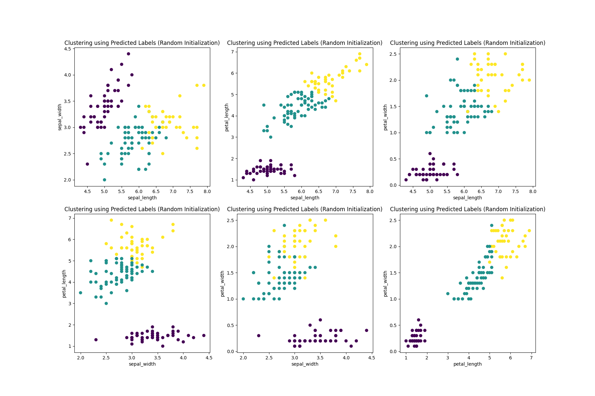
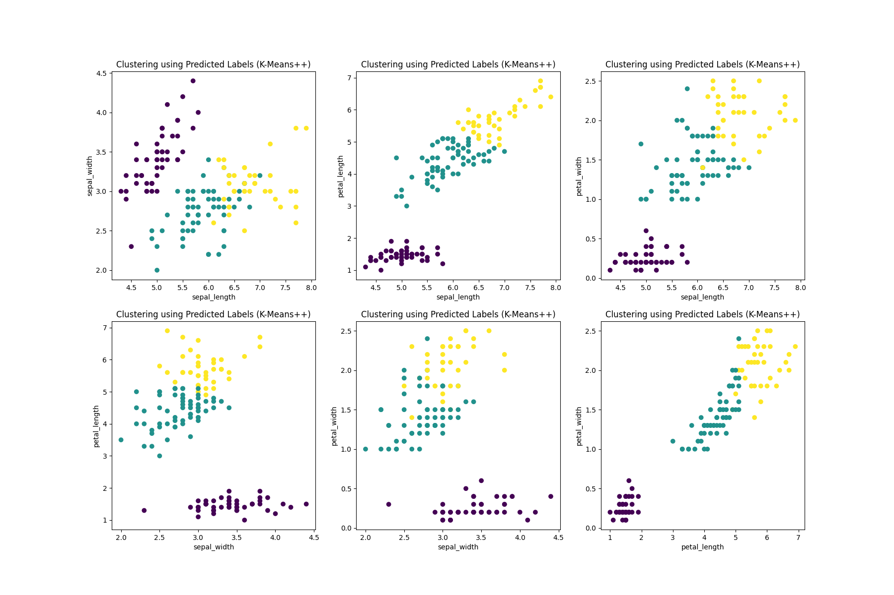

# K-Means Clustering
## Introduction
This repository contains the code for the MIES Coding Assignment - 2.
The dataset used in the assignment is _Fisher's Iris dataset_. 
The iris dataset contains four features (length and width of 
sepals and petals) of 50 samples of three species of Iris 
(_Iris setosa, Iris virginica and Iris versicolor_). These measures 
are used for clustering the samples using k-means algorithm.

Two initializations methods are provided for the clustering:
* `random`: For randomly initializing the cluster centers
* `k-means++`: Initializing cluster centers using k-means++ algorithm

## `KMeans` class
```python
class KMeans(n_clusters=3, init='random', max_iter=10, random_state=42)
```
### Parameters
* __n_clusters: int, default=3__
    
    The number of clusters to form as well as the number of 
    centroids to generate.
* __init: {'random', 'k-means++'}, default='random'__

    Method for initialization.

    'random': choose `n_clusters` observations at random from data
    to initialize centroids

    'k-means++': selects initial cluster centers for k-mean clustering 
    in a smart way to speed up convergence.
* __max_iter: int, default=10__
    
    Maximum number of iterations of the k-means algorithm.
* __random_state: int, default=42__

    Determines random number generation for centroid initialization
### Attributes
* __cluster_centers: numpy.ndarray of shape (n_clusters, n_features)__
    
    Coordinates of cluster centers.
* __labels: numpy.ndarray of shape (n_samples,)__

    Labels for each point.
### Examples
```pycon
>>> from model import KMeans
>>> import numpy as np
>>> X = np.array([[1, 2], [1, 4], [1, 0],
...  [10, 2], [10, 4], [10, 0]])
>>> clf = KMeans(n_clusters=2, random_state=0).fit(X)
Iterations completed: 100%|███████████████████████████████████████████████████████████| 10/10 [00:00<00:00, 561.54it/s]
>>> clf.labels
array([1, 1, 1, 0, 0, 0], dtype=int64)
>>> clf.cluster_centers
array([[10.,  2.],
       [ 1.,  2.]])
```
### Methods
| Method | Functionality |
| ------ | ------------- |
| `fit(x)` | Computes k-means clustering |
| `fit_predict(x)` | Compute cluster centers and predict cluster index for each sample. |
| `predict(x)` | Predict the closest cluster each sample in `x` belongs to. |
## Dependencies
For successfully execution of the scripts, following libraries 
must be installed on your machine.
* numpy
* pandas
* matplotlib
* tqdm
## Running 
To execute the instructions given in the assignment, run the module as
```shell
$ python main.py --dir path_to_dataset --n_cluster 3 --max_iter 10
```
The output will be displayed on the command line itself. In addition to 
that, three plots will be generated in the repository as
* `clustering_using_true_labels.png` contains the scatter plot of the instances using two attribute at a time with clustering done on the basis of true labels.
* `clustering_using_predicted_labels_random_init.png` contains the scatter plot of the instances using two attribute at a time with clustering done on the basis of k-means clustering with random initialization.
* `clustering_using_predicted_labels_kmeans++.png` contains the scatter plot of the instances using two attribute at a time with clustering done on the basis of k-means++ clustering.
## Sample Output
In the command line, you can expect to see the following output:
```
Clustering using k-means with random initialization
iterations: 100%|████████████████████████████████████████████████████████████████████| 10/10 [00:00<00:00, 1580.67it/s]
The Jaccard indices and Cluster Centers after k-means clustering with random initializations are:

        Clusters        Jaccard Index   Cluster Center
        Iris-setosa     1.0             [5.006 3.418 1.464 0.244]
        Iris-versicolor 0.73            [5.88360656 2.74098361 4.38852459 1.43442623]
        Iris-virginica  0.68            [6.85384615 3.07692308 5.71538462 2.05384615]

Clustering using k-means++
iterations: 100%|████████████████████████████████████████████████████████████████████| 10/10 [00:00<00:00, 9779.21it/s]

The Jaccard indices and Cluster Centers after k-means++ clustering are:

        Clusters        Jaccard Index   Cluster Center
        Iris-setosa     1.0             [5.006 3.418 1.464 0.244]
        Iris-versicolor 0.75            [5.9016129  2.7483871  4.39354839 1.43387097]
        Iris-virginica  0.69            [6.85       3.07368421 5.74210526 2.07105263]

Labels of coordinates of centers are given as ['sepal_length', 'sepal_width', 'petal_length', 'petal_width']
Kindly view the plots generated in parent directory for cluster visualization.

DONE.
```
### Clusters using true labels

### Clustering using k-means with random initialization

### Clustering using k-means++

