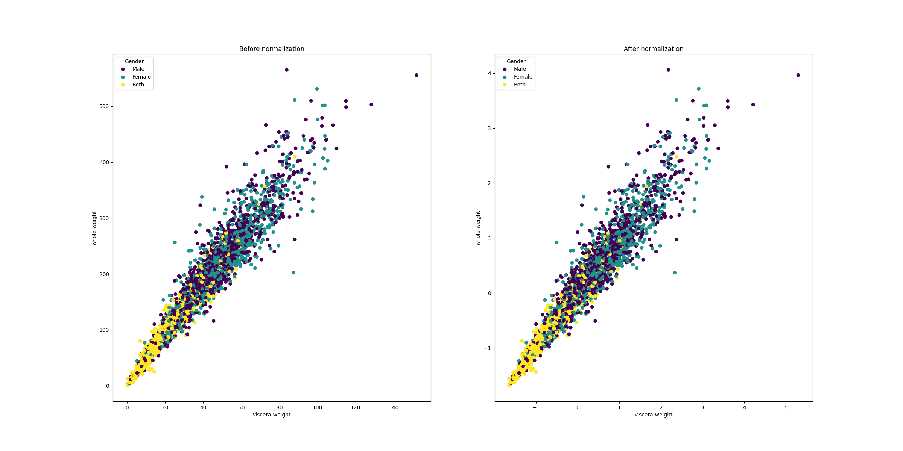
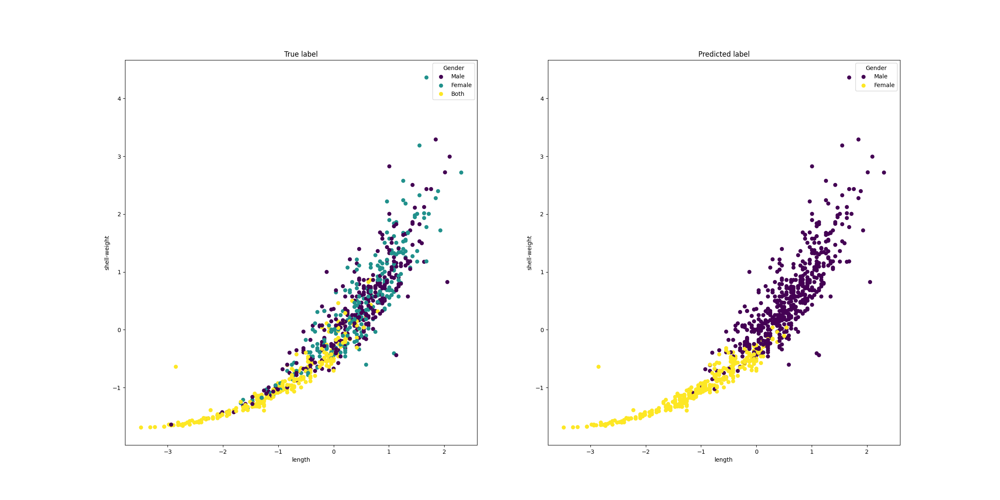
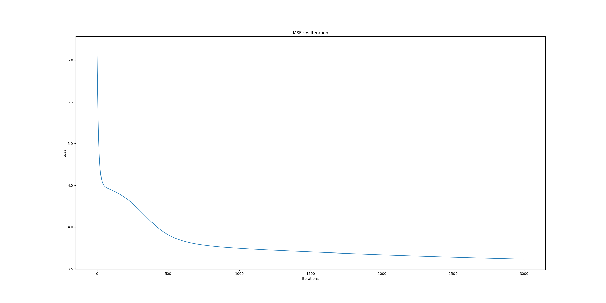
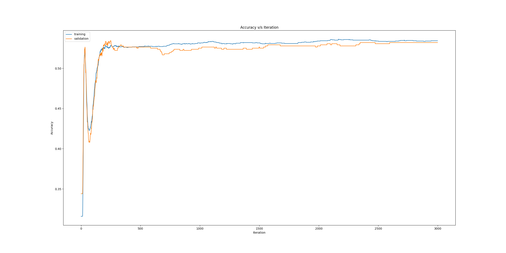

# Neural Network
## Introduction
This repository contains the code for the MIES Coding Assignment-3.
The dataset used contains eight features (length, diameter, height, whole weight, 
shucked weight, viscera weight, shell weight and rings) of 4177 samples of 
snails having gender: male, female or both. These measures 
are used as input to a neural network to predict the gender of the snails.

## `NeuralNetwork` class
```python
class NeuralNetwork(hidden_layers=[8], learning_rate=0.01, batch_size=32, max_iter=500, validation_fraction=0.2, random_state=42)
```
### Parameters
* __hidden_layers: list[int], default=[8]__
    
    The ith element represents the number of neurons in the ith hidden layer.
* __learning_rate: float, default=0.01__

    Learning rate schedule for weight updates.
* __batch_size: int, default=32__
    
    Size of minibatches for stochastic optimizers.
* __max_iter: int, default=500__
    
    Maximum number of iterations.
* __validation_fraction: float, default=0.2__
    
    The proportion of training data to set aside as validation set.
* __random_state: int, default=42__

    Seed for random number generation.
### Attributes
* __layers_dim: list[int]__
    
    Number of nodes in each layers (including input and output)
* __error_curve: list[float]__
    
    Loss computed at each iteration.
* __train_acc: list[float]__
    
    Training accuracy computed at each iteration.
* __val_acc: list[float]__
    
    Validation accuracy computed at each iteration.
* __W, b: list__
    
    List of weights and biases used.
* __dW, db: list__
    
    List of gradient of loss wrt weights and biases used.
### Public Methods
| Method | Functionality |
| ------ | ------------- |
| `fit(x, y)` | Training the neural network |
| `score(x, y)` | Testing the neural network |
| `predict(x)` | Predict the label for each sample in `x`  |
## Dependencies
For successfully execution of the scripts, following libraries 
must be installed on your machine.
* numpy
* pandas
* matplotlib
* tqdm
## Running 
To execute the instructions given in the assignment, run the module as
```shell
$ python main.py --dir Snails.csv --hidden_layers 5
```
The parameters can be further tuned in command line as
```shell
$ python main.py --dir Snails.csv --hidden_layers 8 6 4 --learning_rate 0.01 --max_iter 500 --random_state 42
```
Above instruction will create a neural network with three hidden layers having number of nodes as 8, 6 and 4 
in the order respectively.

The output will be displayed on the command line itself. In addition to 
that, four plots will be generated in the repository as
* `train_scatter_plot.png` contains two randomly selected features in a scatter
plot for training instances before and after normalization.
* `test_scatter_plot.png` contains two randomly selected features in a
scatter plot for test instances for comparing true labels and predicted labels visually.
* `loss.png` contains loss computed over each iteration.
* `accuracy.png` contains training and validation accuracies computed over each iteration.
## Sample Output
In the command line, you can expect to see the following output:
```
Epoch: 100%|█████████████████████████████████████████████████████████████████████████| 500/500 [00:38<00:00, 12.89it/s]

MSE Loss: 3.719934447515759
Training acc: 0.5320121951219512 - Validation acc: 0.5236768802228412
Test acc: 0.5532934131736527

Predicted labels for query vectors:

        Query Vector                                            Label
        [121.   91.   32.  220.7  84.2  60.3  65.    9. ]       Both
        [118.   88.   30.  174.5  77.4  43.   49.    8. ]       Both
        [112.   89.   39.  196.2  61.   44.9  67.   16. ]       Male
        [127.   98.   34.  252.3 107.7  53.3  76.    9. ]       Both

Done, check the directory for the plots.
```
### Scatter plot for training instances

### Scatter plot for test instances

### MSE Loss v/s Iterations

### Accuracy v/s Iterations
