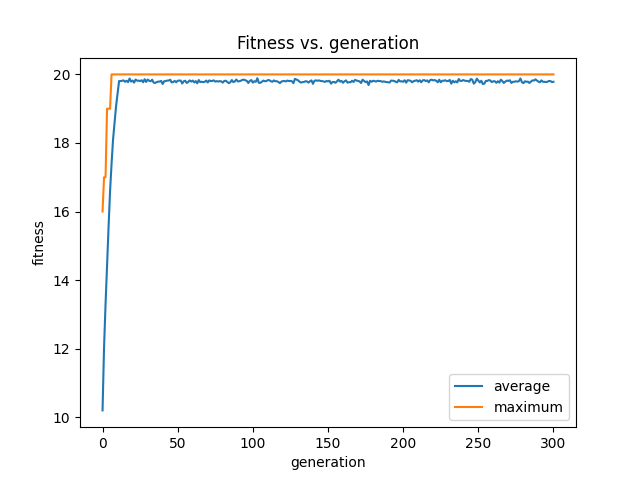

# Genetic Algorithm

## Dependencies
For successful execution of the script, following libraries 
must be installed on your machine.
* numpy
* matplotlib

## Running 
To run the script as per the problem statement, do
```shell
$ python main.py
```
The parameters of the algorithm can be varied as
```shell
$ python main.py --population_size 200 --bit_length 20 --max_iter 300 --mutation_rate 0.01 --random_state 42
```

The output will be displayed on the command line itself. Along with it, a plot containing
average and maximum fitness for each generation is created in the parent directory.

## Results
In the command line, you can expect to see the following output:
```
C:\Users\Utkarsh\Documents\pythonProject>python main.py --random_state 69
Generation: 100%|███████████████████████████████████████████████████████████████████████████████████████████████████████████████████████████████████████████████████████████████| 300/300 [00:03<00:00, 81.17it/s]
+---------------+----------------------+
| Generation    | Fittest chromosome   |
+---------------+----------------------+
|   0           | 11101110110111111010 |
|   1           | 11111111110111101110 |
|   2           | 11100111111111101111 |
|   3           | 11111111110111111111 |
|   4           | 11111111111011111111 |
|   5           | 11111111111111111011 |
|   .           |          .           |
|   .           |          .           |
|   .           |          .           |
| 296           | 11111111111111111111 |
| 297           | 11111111111111111111 |
| 298           | 11111111111111111111 |
| 299           | 11111111111111111111 |
| 300           | 11111111111111111111 |
+---------------+----------------------+

Final fittest chromosome: 11111111111111111111

DONE.
```

## Plot of Fitness vs. generation
